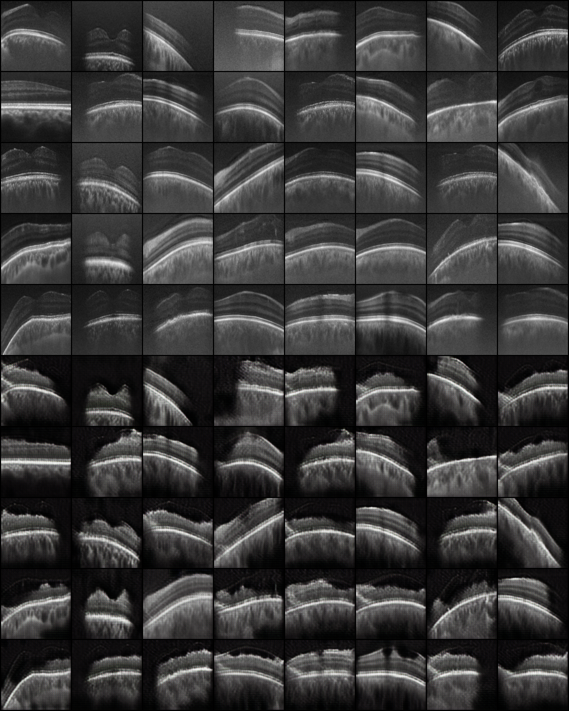

# CycleGan + Classifier for semi-supervise classification
This repo contains part of our expriments for [**ICIP/VIP CUP 2024**](https://2024.ieeeicip.org/vip-cup/) .

## Problem Definition
In [**ICIP/VIP CUP 2024**](https://2024.ieeeicip.org/vip-cup/) requires tackling three tasks: 'Denoising', 'Super-Resolution', and 'Classification'. In this competition, we face a semi-supervised problem where labels belong to a series of B-scans. Therefore, we have very noisy and low-resolution images, and we only have labels for a batch of images.
 

## Datasets
In this project, we use two dataset : 

(1) VIP CUP data that is our noisy data.

(2) [OCT2017](https://www.kaggle.com/datasets/paultimothymooney/kermany2018) dataset, which is our noise-free data.

|VIP CUP 2024 Sample image  |   OCT2017 Sample Image|
|----------------------------|---------------------------|
| | |

## OUR FIRST EXPRIMENT:
In the first experiment, we designed a CycleGAN to convert noisy data to noise-free data. But for using vip cup images, PCA was employed to create noise-less images by reshaping the B-scans and decomposing them into principal components, retaining only the top 15% then use them as the data.

.tiff.png',%20'RawDataQA17%20(143).tiff.png']_ICIP_to_Dk.png) 

However, after some experiments, we noticed that although this method is good enough for making noise-free images, the whole process cannot retain the disease in the first data to the generated one. Therefore, we added another model as a classifier to check whether the base image and the generated image belong to the same class of disease.

If the models reach the goals, we expected that not only generators can make noise-free images but also classifier can produce labels in B-scan level.

## FLOW CHART 

